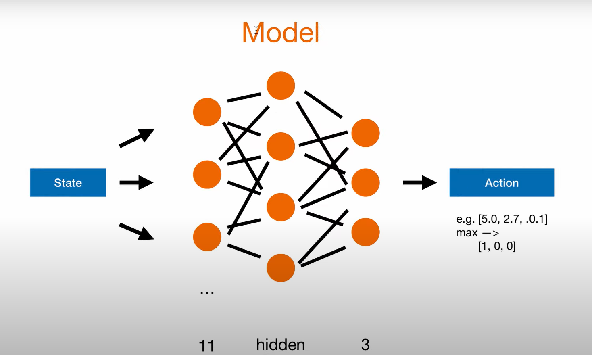
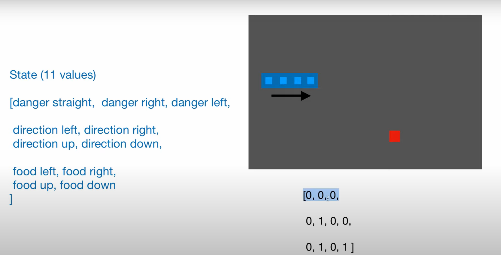

# 贪吃蛇-人工智能

## 想法

- 自顶向下设计

  先从人工智能的角度出发, 需要什么, 然后再来设计游戏

## 设计



### 基本思路

state = get_state(game)

action = model.predict(state)

feedback = game.play_step(action)

data_set.record_data(state, action, feedback)

model.traning(data_set)

> 采用 agent 执行这些

### 输出(action)

- [1 0 0]

  straight

- [0 1 0]

  turn right

- [0 0 1]

  turn left

> 采用适配器的想法, 在机器学习模式采用向量形式思考, 在游戏翻译成具体的含义

### 输入(state)

布尔值:

- danger straight

- danger right

- danger left

> 对危险的感知, 以蛇的视角带入信息

- direction left

- direction right

- direction up

- direction down

> 当前策略的信息

- food left

- food right

- food up

- food down

> 对目标的感知

- example

  

### feedback

根据 model-01 设计

- state

  执行完动作后的状态

- reward

  奖励

### 设计游戏

- 期望

  - 满足形式

    $$feedback = game.play\_step(action)$$

  - 游戏不知道 agentAI 的存在

- 实现-01

  采用**适配器**的方法, 进行游戏数据和人工智能数据转化

  对于游戏中不会预先设计`奖励`这个概念, 可以采用回调函数的方式. 设置一个 hook, 当有碰撞, 或者吃到自己, 则发送消息到 hook, 在 hook 里面将有效的消息转换为奖励

  > 借鉴的想法是 Windows 程序设计里面, Windows 的编写, 通过 message 处理消息, 同时最好有 sendmessage 来发送消息改变游戏, 但为了避免设计复杂, 决定使用 hook 的返回值来控制游戏结束与否

### 适配器

- action

  AI_action -> game_action

  上下左右, 用复数(复平面)表示(i, -i, -1, 1), 然后向左转为乘以 i,向右转为乘以-i

## 再设计

摒弃[设计游戏](#设计游戏)部分满足的形式, 加强`游戏不需要意识到人工智能的存在`的想法

像生物病毒一样(借鉴普通生物学, DNA 重组技术的想法), 通过 Hook 注入人工智能代码, 使得游戏获得智能

在考虑训练的策略, 每次执行完动作可以训练一次, 游戏结束后又可以整体训练一次

```python
game = SnakeGame(hook=AI_hook)
while True
    game.reset()
    # start 里面也有一个游戏循环
    game.start()# 内部hook调用AI_hook
    agent.train(data_set)
```

如果需要单纯的运行游戏, 则如下

```python
game.start()
```

此时的结构, 游戏没有意识到人工智能的存在. 需要重点设计的是 Hook

### Hook

- 期望

  - 捕获感兴趣的信息

    比如贪吃蛇吃到自己

    游戏循环的开始

    键盘输入

  - 能控制输入

    获取游戏的输入, 同时能篡改信息, 传递给游戏执行

    不篡改就按照默认的方式执行

借鉴 Windows 程序设计的程序结构

```c
LRESULT CALLBACK WndProc(HWND hwnd, UINT message, WPARAM wParam, LPARAM lParam)
{
    switch (message)
    {
        //窗口销毁消息
        case WM_DESTROY:
            PostQuitMessage(0);
            return 0;
    }
    return DefWindowProc(hwnd, message, wParam, lParam);
}
```

### 贪吃蛇

- 理念

  由游戏自定向下实现

- 游戏框架

  ```python
  while True
      if game_over:
          break
      sys_event = get_sys_event()
      action = translate_sys_event(sys_event)
      update_logic(action)
      draw_ui()
  ```

- 考虑插入 Hook

  深入思考发现, 自己需要改变游戏的 game_over 来控制游戏结束与否. 这需要获取游戏 game_over 的地址, 传递 game_over 的引用有点难, 于是想把 game_over 放入一个对象中传递

  进一步发展上面的思考就有, 把游戏的状态从游戏中分离, 通过篡改游戏的数据来改变游戏, 而游戏的逻辑并不改变

  ```python
  while True:
      if self.state['game_over']:
          break
      self.state['input'] = pygame.event.get()
      self.state['action'] = self._translate_event(self.state['input'])
      self._exe_action(self.state['action'])
      self._draw_ui()
  ```

- 设计游戏循环

  ```python
  while True:
      self.hook('msg_loop_start', self.state)
      if self.state['game_over']:
          self.hook('msg_game_over', self.state)
          break
      self.state['input'] = pygame.event.get()
      self.hook('msg_game_input', self.state)
      self.state['action'] = self._translate_event(self.state['input'])
      self.hook('msg_game_action', self.state)
      self._exe_action(self.state['action'])
      self.hook('msg_game_execute', self.state)
      self.hook('msg_game_ui_before', self.state)
      self._draw_ui()
      self.hook('msg_game_ui_after', self.state)
      self.hook('msg_loop_end', self.state)
  ```

根据以上思考完善游戏
