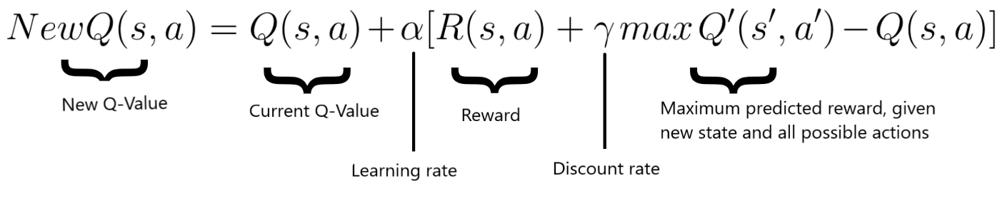
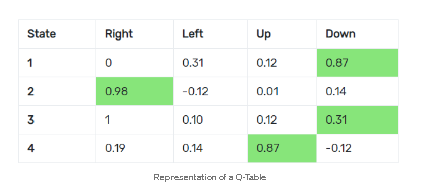

# Deep Q Learning

## 参考

- [An introduction to Deep Q-Learning: let’s play Doom](https://www.freecodecamp.org/news/an-introduction-to-deep-q-learning-lets-play-doom-54d02d8017d8/)

- [Diving deeper into Reinforcement Learning with Q-Learning](https://www.freecodecamp.org/news/diving-deeper-into-reinforcement-learning-with-q-learning-c18d0db58efe/)

- [How to teach AI to play Games: Deep Reinforcement Learning](https://towardsdatascience.com/how-to-teach-an-ai-to-play-games-deep-reinforcement-learning-28f9b920440a)
- [DeepRL 系列(7): DQN(Deep Q-learning)算法原理与实现](https://zhuanlan.zhihu.com/p/97856004)

- bellman equation

  

- loss function

  $$loss = ( Q _ { n e w } - Q ) ^ { 2 }$$

  Mean Squared Error

## 理解

- 01

  原来的状态, 作为输入

  执行动作后的状态和奖励作为反馈的标签

  

  提过预测能力
